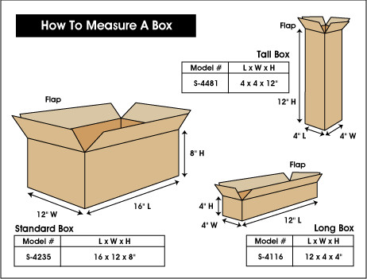

# [How do you write dimensions for an object like doors or a box?](https://www.uline.com/CustomerService/ULINE_FAQ_Ans?FAQ_ID=57)
 	
* L x W x H for 3D object.
* W x H for 2D object like an image.

Listed dimensions for boxes are always inside dimensions.

* The first dimension is length (L).
 * Length is always the longest side of the box that has a flap.
* The second dimension is width (W).
 * Width is the second longest side with a flap.
* The third dimension is height (H).
 * Height is the only dimension without a flap.
