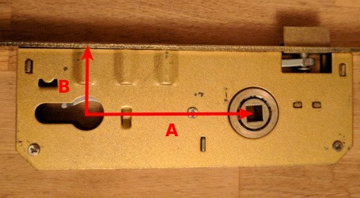
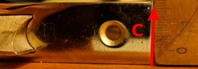

# Door locks

* [Anko.lv Brīvības iela 136 (Brīvības - Tallinas corner)](http://www.anko.lv/shop/).
* [Depo Rīga, Berģi, Siguldas šos. 6](https://depo.lv/).

## What measures are required to find a lock?

* A - Distance from the center of the handle to the center of the keyhole's.
* B - Distance from the center of the keyhole to the edge of the lock.

* C - Width of the lock itself.

## My door lock's measures as an example

* A - 80 mm.
* B - 45 mm.
* C - 20 mm.