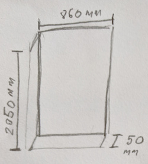

# Doors

## My door dimensions in mm as an example

* Length - 2050
* Width - 860
* Height - 50

or [in short 2050 x 860 x 50](Dimension-format.md).

## Plank for the door

* Length - 250
* Width - 100
* Height - 25

or in short 250 x 100 x 25.